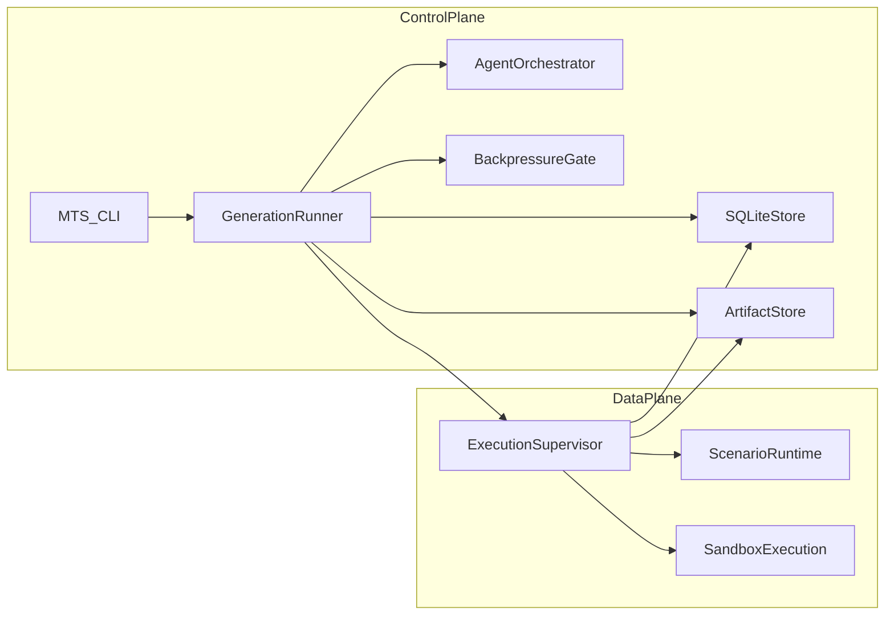

# MTS Infrastructure Plan (Phase 0-2)

## Confirmed Decisions

- Initial scope: `control-plane-core` only (no dashboard in first milestone).
- Deployment strategy: `dual-track` from day one (local Docker + Fly parity).
- Orchestration: `Agent SDK from start` (inner loops).
- Persistence: `SQLite + filesystem artifacts`.

## Target Repository Layout

- `[mts/pyproject.toml](mts/pyproject.toml)` - Python project config, dependency groups, tooling.
- `[mts/src/mts/cli.py](mts/src/mts/cli.py)` - `mts` CLI entrypoint (`run`, `resume`, `replay`, `benchmark`).
- `[mts/src/mts/config/](mts/src/mts/config/)` - environment + scenario config loaders.
- `[mts/src/mts/scenarios/base.py](mts/src/mts/scenarios/base.py)` - `ScenarioInterface`, `Observation`, `Result`.
- `[mts/src/mts/scenarios/grid_ctf/](mts/src/mts/scenarios/grid_ctf/)` - first scenario implementation.
- `[mts/src/mts/loop/generation_runner.py](mts/src/mts/loop/generation_runner.py)` - generation orchestrator.
- `[mts/src/mts/agents/](mts/src/mts/agents/)` - competitor/analyst/coach/architect runners via Agent SDK.
- `[mts/src/mts/execution/](mts/src/mts/execution/)` - strategy execution boundary + timeout contracts.
- `[mts/src/mts/storage/sqlite_store.py](mts/src/mts/storage/sqlite_store.py)` - run/generation/match metadata store.
- `[mts/src/mts/storage/artifacts.py](mts/src/mts/storage/artifacts.py)` - markdown/json artifact I/O.
- `[mts/src/mts/prompts/](mts/src/mts/prompts/)` - role templates + scenario prompt injection.
- `[mts/src/mts/backpressure/](mts/src/mts/backpressure/)` - improvement scoring + gate logic.
- `[mts/src/mts/integrations/primeintellect/](mts/src/mts/integrations/primeintellect/)` - sandbox client + warmup hooks.
- `[mts/migrations/](mts/migrations/)` - SQLite schema migrations.
- `[mts/tests/](mts/tests/)` - unit/integration tests.
- `[infra/docker/Dockerfile](infra/docker/Dockerfile)` - local runtime image.
- `[infra/docker/docker-compose.yml](infra/docker/docker-compose.yml)` - local orchestration + mounted artifacts.
- `[infra/fly/fly.toml](infra/fly/fly.toml)` - Fly app config parity with local runtime.
- `[infra/scripts/bootstrap.sh](infra/scripts/bootstrap.sh)` - one-command setup.
- `[knowledge/](knowledge/)` - generated playbooks, analyses, architect logs, tools.
- `[runs/](runs/)` - generation outputs, replay JSON, metrics snapshots.
- `[skills/](skills/)` - operational workflow skills to symlink into `.claude/skills`.

## Control Plane/Data Plane Boundaries

- Control plane: generation loop, agent dispatch, scoring/backpressure, state persistence.
- Data plane: isolated strategy execution and match runtime.
- Enforce strict interface between layers:
  - control sends `strategy artifact + scenario seed + limits`
  - data plane returns `result + replay + telemetry + validation errors`

## Phase Plan

## Phase 0 - Foundation (Day 1)

- Initialize Python project and toolchain with pinned runtime constraints (3.11+).
- Add typed domain models for `Observation`, `Result`, replay envelopes, and generation metrics.
- Define `ScenarioInterface` including natural-language methods required for prompt injection.
- Create SQLite schema for runs, generations, matches, agent outputs, backpressure decisions.
- Implement artifact path conventions for deterministic run folders.
- Milestone: `mts --help` and schema migrations run successfully in local + Fly containers.

## Phase 1 - Core Execution Spine (Day 2)

- Implement generation runner with explicit stage pipeline: `COMPETE -> ANALYZE -> COACH -> EVOLVE -> ARCHITECT -> VALIDATE`.
- Build Agent SDK orchestrator with role-specific adapters (Competitor, Analyst, Coach, Architect).
- Implement prompt assembly service injecting scenario contracts at runtime.
- Add execution supervisor contract with timeout/resource controls and replay capture.
- Add backpressure gate for measurable progress checks and rollback signals.
- Milestone: `mts run --scenario grid_ctf --gens 1` produces persisted metadata + artifacts.

## Phase 2 - Hackathon-Ready Infrastructure Hardening (Day 3)

- Add PrimeIntellect integration module with environment lifecycle hooks and warm provisioning during EVOLVE.
- Keep runtime selection abstraction (`local executor` vs `primeintellect executor`) without changing loop logic.
- Add structured logging and generation event stream emitter (file/socket-ready for later dashboard).
- Add resilience: retries, idempotent generation resume, failed-stage recovery markers.
- Add CI checks: tests, type checks, lint, migration smoke test, minimal run smoke test.
- Milestone: 3-generation run stable in local mode, executor-switch integration tested.

## Data/Artifact Contracts (must be stable early)

- `[runs/{run_id}/generations/{gen_n}/metrics.json](runs/{run_id}/generations/{gen_n}/metrics.json)`
- `[runs/{run_id}/generations/{gen_n}/replays/*.json](runs/{run_id}/generations/{gen_n}/replays/*.json)`
- `[knowledge/{scenario}/analysis/gen_{n}.md](knowledge/{scenario}/analysis/gen_{n}.md)`
- `[knowledge/{scenario}/playbook.md](knowledge/{scenario}/playbook.md)`
- `[knowledge/{scenario}/tools/*.py](knowledge/{scenario}/tools/*.py)`
- `[knowledge/{scenario}/architect/changelog.md](knowledge/{scenario}/architect/changelog.md)`
- `[skills/*.md](skills/*.md)`

## Quality Gates (Infrastructure-First)

- Generation idempotency: rerunning same generation does not corrupt state.
- Scenario swap contract: loop runs with at least two scenarios (Grid CTF + Othello) without agent code changes.
- Backpressure determinism: same inputs produce same gate decision.
- Executor safety: strategy process timeout + validation errors are captured and non-fatal to orchestrator.
- Local/Fly parity: same image + env contract, no code-path drift.

## Immediate Next Execution Steps After Plan Approval

- Scaffold repository layout and Python package.
- Implement `ScenarioInterface` and baseline storage/artifact services.
- Wire Agent SDK role runners with no-op scenario run to validate end-to-end plumbing.
- Add first runnable `grid_ctf` skeleton and one-generation smoke test command.

