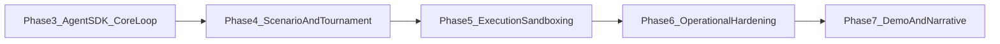

# MTS Next Phases Detailed Plan

## Current Baseline (Confirmed)

- Core control plane exists: CLI, generation runner, storage, artifacts, basic backpressure, and two scenarios.
- Verification is green with `uv` (`ruff`, `mypy`, `pytest`, smoke runs).
- Key gaps vs blueprint: mock agents, simplified scenario interface, non-enforced backpressure, minimal tournament/Elo, skeletal sandbox integration, and no dashboard stream consumer.

## Target Sequence (Next Several Phases)

## Phase 3: Real Agent SDK + Role-Accurate Loop

### Goal

Replace deterministic mock orchestration with real role runners and model tiering (Competitor Sonnet, Analyst Haiku, Coach/Architect Opus), while preserving current contracts.

### Implementation

- Add Agent SDK adapters and role clients:
  - [mts/src/mts/agents/orchestrator.py](mts/src/mts/agents/orchestrator.py)
  - New files: [mts/src/mts/agents/competitor.py](mts/src/mts/agents/competitor.py), [mts/src/mts/agents/analyst.py](mts/src/mts/agents/analyst.py), [mts/src/mts/agents/coach.py](mts/src/mts/agents/coach.py), [mts/src/mts/agents/architect.py](mts/src/mts/agents/architect.py).
- Expand prompt assembly and runtime injection:
  - [mts/src/mts/prompts/templates.py](mts/src/mts/prompts/templates.py)
- Add model/config controls:
  - [mts/src/mts/config/settings.py](mts/src/mts/config/settings.py)
- Persist per-role token/cost/latency metadata:
  - [mts/src/mts/storage/sqlite_store.py](mts/src/mts/storage/sqlite_store.py)
  - [mts/migrations/001_initial.sql](mts/migrations/001_initial.sql) (or new migration)

### Acceptance Criteria

- One generation executes all four role stages with real LLM responses.
- Each stage writes artifacts and DB rows with role metadata.
- Role/model selection is env-configurable and validated.

### Verification

- Unit tests for role runners and parsing failures.
- Integration test: single generation with all role outputs persisted.

## Phase 4: Full Scenario Interface + Tournament/Elo

### Goal

Adopt blueprint-compatible scenario abstraction and measurable competition outcomes.

### Implementation

- Upgrade scenario interface to blueprint shape (rules, strategy interface, eval criteria, state loop, replay narrative):
  - [mts/src/mts/scenarios/base.py](mts/src/mts/scenarios/base.py)
- Refactor scenarios to implement full contract:
  - [mts/src/mts/scenarios/grid_ctf/scenario.py](mts/src/mts/scenarios/grid_ctf/scenario.py)
  - [mts/src/mts/scenarios/othello.py](mts/src/mts/scenarios/othello.py)
- Add tournament runner + Elo computation:
  - New files: [mts/src/mts/execution/tournament.py](mts/src/mts/execution/tournament.py), [mts/src/mts/execution/elo.py](mts/src/mts/execution/elo.py)
- Inject narrative observations into COMPETE/ANALYZE prompts:
  - [mts/src/mts/loop/generation_runner.py](mts/src/mts/loop/generation_runner.py)
  - [mts/src/mts/prompts/templates.py](mts/src/mts/prompts/templates.py)
- Persist generation-level metrics (Elo, W/L, confidence intervals).

### Acceptance Criteria

- `grid_ctf` and `othello` both run unchanged agent logic with runtime scenario injection.
- Metrics include Elo trend and per-match replay narratives.
- Replay artifacts are rich enough for analyst summarization.

### Verification

- Property tests for Elo monotonic updates and deterministic seeds.
- Two-scenario integration tests in CI.

## Phase 5: Data Plane Sandboxing + PrimeIntellect Executor

### Goal

Make strategy execution safely isolated and pluggable (`local` vs `primeintellect`) without control-plane logic drift.

### Implementation

- Introduce executor interface and implementations:
  - New files: [mts/src/mts/execution/executors/base.py](mts/src/mts/execution/executors/base.py), [mts/src/mts/execution/executors/local.py](mts/src/mts/execution/executors/local.py), [mts/src/mts/execution/executors/primeintellect.py](mts/src/mts/execution/executors/primeintellect.py)
- Enforce timeout/memory/network policy at execution boundary:
  - [mts/src/mts/execution/supervisor.py](mts/src/mts/execution/supervisor.py)
- Implement real PrimeIntellect lifecycle client (warm provisioning during EVOLVE):
  - [mts/src/mts/integrations/primeintellect/client.py](mts/src/mts/integrations/primeintellect/client.py)
- Add failure recovery markers + idempotent retry semantics:
  - [mts/src/mts/loop/generation_runner.py](mts/src/mts/loop/generation_runner.py)

### Acceptance Criteria

- Untrusted strategy code executes only inside executor boundary.
- Timeout and validation failures are captured as non-fatal generation outcomes.
- Executor switch requires config change only.

### Verification

- Integration tests with intentionally invalid/slow strategies.
- Smoke test matrix: `local` and `primeintellect` executor modes.

## Phase 6: Operational Backpressure + Knowledge Evolution

### Goal

Turn gate decisions into real control actions and accumulate shared intelligence over generations.

### Implementation

- Backpressure branch behavior (`advance`, `retry`, `rollback`) with thresholds and cooldowns:
  - [mts/src/mts/backpressure/gate.py](mts/src/mts/backpressure/gate.py)
  - [mts/src/mts/loop/generation_runner.py](mts/src/mts/loop/generation_runner.py)
- Move from overwrite to append/merge knowledge artifacts:
  - [mts/src/mts/storage/artifacts.py](mts/src/mts/storage/artifacts.py)
- Architect cadence (every 3rd gen) and measured tool impact over rolling window.
- Skill writeback workflow for operational learnings under [skills/](skills/).

### Acceptance Criteria

- Gate decisions materially alter subsequent execution.
- Playbook/architect changelog show cumulative evolution with generation lineage.
- Architect-produced tools can be consumed by competitors in later generations.

### Verification

- Deterministic replay tests for same-seed gate outcomes.
- Regression tests for retry/rollback branches.

## Phase 7: Demo UX, Event Stream, and Reliability Polish

### Goal

Deliver a compelling live demo with real-time visibility and robust deployment parity.

### Implementation

- Promote NDJSON events to stream-ready schema for dashboard/websocket consumer:
  - [mts/src/mts/loop/events.py](mts/src/mts/loop/events.py)
- Add minimal dashboard backend adapter and replay viewer API surface.
- Harden infra parity and deployment docs:
  - [infra/docker/Dockerfile](infra/docker/Dockerfile)
  - [infra/docker/docker-compose.yml](infra/docker/docker-compose.yml)
  - [infra/fly/fly.toml](infra/fly/fly.toml)
  - [infra/scripts/bootstrap.sh](infra/scripts/bootstrap.sh)
- Expand CI to include both scenarios and multi-generation smoke checks:
  - [.github/workflows/ci.yml](.github/workflows/ci.yml)

### Acceptance Criteria

- Live generation events can drive a dashboard with near-real-time updates.
- End-to-end demo script succeeds locally and in Fly parity environment.
- CI validates both scenarios and at least one 3-generation run.

### Verification

- Runbook rehearsal with timed demo checklist.
- Failure-injection dry run and recovery proof.

## Cross-Phase Quality Gates

- Every phase must pass: `uv run ruff check src tests`, `uv run mypy src`, `uv run pytest`.
- Add phase-specific smoke command(s) and keep in CI as they stabilize.
- Maintain strict control-plane/data-plane boundary contract in typed interfaces.

## Immediate Execution Order

1. Phase 3 (real agents + model tiers)
2. Phase 4 (full scenario abstraction + tournament Elo)
3. Phase 5 (sandboxed executors + PrimeIntellect integration)
4. Phase 6 (operational backpressure + cumulative knowledge/skills)
5. Phase 7 (demo stream + reliability polish)

