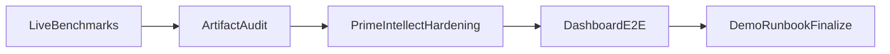

# MTS Post-Build Validation Plan

## Scope and Constraints

- Benchmark size: **10 generations per scenario**.
- Execution mode: **live by default** (`anthropic` + `primeintellect`).
- Goal: convert the current "green" build into a demo-ready, reliability-validated package.

## Workstream Sequence

## 1) Live Benchmarks (10-gen each)

- Run long live checks:
  - `grid_ctf` 10 generations
  - `othello` 10 generations
- Capture run IDs and baseline metrics from `mts status` / `mts list`.
- Persist benchmark summary artifact (scores, Elo trend, gate decisions, retries).

Primary files/paths involved:

- `[/Users/jayscambler/Repositories/MTS/mts/src/mts/cli.py](/Users/jayscambler/Repositories/MTS/mts/src/mts/cli.py)`
- `[/Users/jayscambler/Repositories/MTS/runs/](/Users/jayscambler/Repositories/MTS/runs/)`
- `[/Users/jayscambler/Repositories/MTS/knowledge/](/Users/jayscambler/Repositories/MTS/knowledge/)`

## 2) Artifact Quality Audit

- Review generated artifacts for both scenarios:
  - playbook evolution quality
  - architect changelog usefulness
  - generated tool validity and repeatability
- Evaluate whether competitor outputs meaningfully consume tool context.
- Record findings and classify issues into: prompt quality, tooling quality, and gate logic quality.

Primary paths:

- `[/Users/jayscambler/Repositories/MTS/knowledge/grid_ctf/](/Users/jayscambler/Repositories/MTS/knowledge/grid_ctf/)`
- `[/Users/jayscambler/Repositories/MTS/knowledge/othello/](/Users/jayscambler/Repositories/MTS/knowledge/othello/)`
- `[/Users/jayscambler/Repositories/MTS/skills/](/Users/jayscambler/Repositories/MTS/skills/)`

## 3) PrimeIntellect Contract Hardening

- Verify real endpoint behavior against current request/response assumptions.
- Tighten parsing/validation for warm + execute payloads and attach explicit error taxonomy.
- Ensure fallback/recovery markers are consistently produced when remote responses are malformed or partial.
- Add/expand tests for contract mismatch handling.

Primary files:

- `[/Users/jayscambler/Repositories/MTS/mts/src/mts/integrations/primeintellect/client.py](/Users/jayscambler/Repositories/MTS/mts/src/mts/integrations/primeintellect/client.py)`
- `[/Users/jayscambler/Repositories/MTS/mts/src/mts/execution/executors/primeintellect.py](/Users/jayscambler/Repositories/MTS/mts/src/mts/execution/executors/primeintellect.py)`
- `[/Users/jayscambler/Repositories/MTS/mts/src/mts/loop/generation_runner.py](/Users/jayscambler/Repositories/MTS/mts/src/mts/loop/generation_runner.py)`
- `[/Users/jayscambler/Repositories/MTS/mts/tests/](/Users/jayscambler/Repositories/MTS/mts/tests/)`

## 4) Dashboard and Stream E2E Validation

- Run dashboard server and execute live benchmark while observing stream updates.
- Verify all critical API routes + websocket behavior under active generation load.
- Confirm replay rendering accuracy for both scenarios and multi-generation navigation.

Primary files:

- `[/Users/jayscambler/Repositories/MTS/mts/src/mts/server/app.py](/Users/jayscambler/Repositories/MTS/mts/src/mts/server/app.py)`
- `[/Users/jayscambler/Repositories/MTS/mts/dashboard/index.html](/Users/jayscambler/Repositories/MTS/mts/dashboard/index.html)`
- `[/Users/jayscambler/Repositories/MTS/mts/src/mts/loop/events.py](/Users/jayscambler/Repositories/MTS/mts/src/mts/loop/events.py)`

## 5) Demo Runbook Finalization

- Finalize one-command demo path with verified run IDs and expected outputs.
- Add short troubleshooting section (missing creds, endpoint errors, stream lag, fallback behavior).
- Ensure CI mirrors core smoke checks used in demo narrative.

Primary files:

- `[/Users/jayscambler/Repositories/MTS/scripts/demo.sh](/Users/jayscambler/Repositories/MTS/scripts/demo.sh)`
- `[/Users/jayscambler/Repositories/MTS/mts/README.md](/Users/jayscambler/Repositories/MTS/mts/README.md)`
- `[/Users/jayscambler/Repositories/MTS/.github/workflows/ci.yml](/Users/jayscambler/Repositories/MTS/.github/workflows/ci.yml)`

## Completion Gates

- Live benchmarks complete for both scenarios (10-gen each) with documented run IDs.
- Artifact audit completed and any critical regressions fixed.
- PrimeIntellect contract checks hardened and validated.
- Dashboard websocket + replay endpoints verified during live run.
- Full quality checks pass:
  - `uv run ruff check src tests`
  - `uv run mypy src`
  - `uv run pytest`

