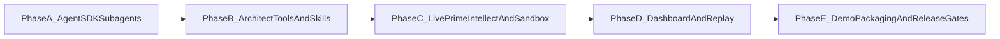

# MTS Remaining Blueprint Plan

## Scope Locked

- Implement **all remaining blueprint items** in one execution stream.
- PrimeIntellect mode is **live-required** (real credentials + real remote execution verification).

## Remaining Work Map

## Phase A: True Agent SDK Subagent Orchestration

### Goal

Replace role-level plain API calls with Agent SDK subagent orchestration and controlled parallelism.

### Changes

- Refactor orchestration and role execution:
  - `[mts/src/mts/agents/orchestrator.py](mts/src/mts/agents/orchestrator.py)`
  - `[mts/src/mts/agents/llm_client.py](mts/src/mts/agents/llm_client.py)`
- Keep competitor first; run analyst/coach/architect in parallel after strategy finalization.
- Add explicit subagent lifecycle metadata persistence:
  - `[mts/src/mts/storage/sqlite_store.py](mts/src/mts/storage/sqlite_store.py)`
  - New migration in `[mts/migrations/](mts/migrations/)`
- Add/validate SDK dependency and config surface:
  - `[mts/pyproject.toml](mts/pyproject.toml)`
  - `[mts/src/mts/config/settings.py](mts/src/mts/config/settings.py)`

### Acceptance

- One generation shows Agent SDK-backed role executions with role/model/latency/token metadata in DB.

## Phase B: Architect Tool Generation + Competitor Tool Consumption + Skills Inheritance

### Goal

Turn architect output into executable tools used by competitors and operationalize skills inheritance.

### Changes

- Architect emits structured tool specs and code artifacts (not only markdown):
  - `[mts/src/mts/agents/architect.py](mts/src/mts/agents/architect.py)`
  - `[mts/src/mts/prompts/templates.py](mts/src/mts/prompts/templates.py)`
- Persist/version tools and load for competitor use:
  - `[mts/src/mts/storage/artifacts.py](mts/src/mts/storage/artifacts.py)`
  - `[mts/src/mts/loop/generation_runner.py](mts/src/mts/loop/generation_runner.py)`
  - `[mts/src/mts/agents/competitor.py](mts/src/mts/agents/competitor.py)`
- Implement skills symlink inheritance into `.claude/skills`:
  - `[infra/scripts/bootstrap.sh](infra/scripts/bootstrap.sh)`
  - `[mts/src/mts/config/settings.py](mts/src/mts/config/settings.py)`

### Acceptance

- Architect-generated tools appear under `knowledge/{scenario}/tools/` and affect subsequent competitor outcomes.
- Skill files are discoverable from `.claude/skills` via deterministic symlink setup.

## Phase C: Live PrimeIntellect + Hardened Sandbox Path

### Goal

Deliver resilient live remote execution with strict failure handling and hardened local fallback path.

### Changes

- Add retries/backoff and explicit recovery policy for remote calls:
  - `[mts/src/mts/integrations/primeintellect/client.py](mts/src/mts/integrations/primeintellect/client.py)`
  - `[mts/src/mts/execution/executors/primeintellect.py](mts/src/mts/execution/executors/primeintellect.py)`
  - `[mts/src/mts/loop/generation_runner.py](mts/src/mts/loop/generation_runner.py)`
- Tighten local execution policy and limits docs:
  - `[mts/src/mts/execution/executors/local.py](mts/src/mts/execution/executors/local.py)`
  - New docs file `[mts/docs/sandbox.md](mts/docs/sandbox.md)`

### Acceptance

- `MTS_EXECUTOR_MODE=primeintellect` performs successful live warm-provision + execution in verification runs.
- Remote failures are captured as non-fatal generation outcomes with recovery markers.

## Phase D: Dashboard, WebSocket Stream, Replay Viewer

### Goal

Provide live observability and replay UX for demo.

### Changes

- Build server endpoints for runs/status/replay + WebSocket event stream:
  - New package `[mts/src/mts/server/](mts/src/mts/server/)`
  - New app file `[mts/src/mts/server/app.py](mts/src/mts/server/app.py)`
- Add replay viewer frontend:
  - New dashboard app under `[mts/dashboard/](mts/dashboard/)`
- Add CLI serve command:
  - `[mts/src/mts/cli.py](mts/src/mts/cli.py)`

### Acceptance

- Live run emits events consumed over WebSocket.
- Replay viewer renders generation replays for `grid_ctf` and `othello`.

## Phase E: Demo Packaging + Release Gates

### Goal

Ship a one-command demo path with robust verification and deployment parity.

### Changes

- Add reproducible demo script and seeded demo data:
  - New `[scripts/demo.sh](scripts/demo.sh)`
  - New `[mts/demo_data/](mts/demo_data/)`
- Update infra and docs for full runbook:
  - `[infra/docker/docker-compose.yml](infra/docker/docker-compose.yml)`
  - `[infra/fly/fly.toml](infra/fly/fly.toml)`
  - `[mts/README.md](mts/README.md)`
- Expand CI gates:
  - `[.github/workflows/ci.yml](.github/workflows/ci.yml)`

### Acceptance

- Demo can be run locally from one command.
- CI validates both scenarios, multi-generation run, and dashboard API smoke.

## Verification Matrix (Required Before Done)

- Static checks: `uv run ruff check src tests`, `uv run mypy src`, `uv run pytest`.
- Live PrimeIntellect proof: at least one successful remote execution run with real credentials in logs/artifacts.
- UX proof: dashboard receives event stream and replay endpoint renders expected payloads.
- Recovery proof: forced remote failure path records recovery marker and keeps orchestrator alive.

